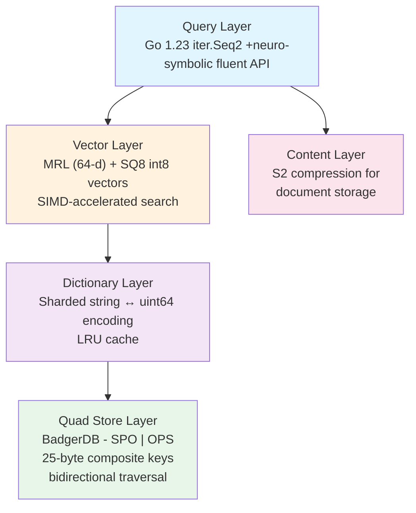

# MEB

**Mangle Extension for Badger**

A Pure Go engine for massive-scale Knowledge Graphs with integrated Vector Similarity Search.

[](https://opensource.org/licenses/Apache-2.0)

---

## What is MEB?

MEB is a **high-performance, standalone Embedded Neuro-Symbolic Store** designed for modern AI applications (RAG, Code Intelligence, Recommendation). Unlike traditional database servers, MEB is a **Pure Go library** that lives inside your application, eliminating network latency and complex infrastructure overhead.

It bridges the gap between structured relational data (**Knowledge Graphs**) and unstructured semantic data (**Vector Embeddings**) in a single, lightweight binary.

**Built for extreme scale:**

- **1 Billion+ facts** on disk
- **50 Million+ vectors** in memory
- **Sub-millisecond** query performance
- **Zero-dependency:** No CGO, no external database server, just import and go

## Why MEB?

* **Hybrid Intelligence**: Combine Boolean graph filters with Vector similarity in a single atomic query
* **Massive Scale**: Optimized for NVMe storage using a specialized Dual-index (SPO, OPS) architecture for bidirectional graph traversal
* **Extreme Efficiency**: Vector Compression - 768-d float vectors reduced to 64-byte SQ8 integers using MRL
* **Data Compression**: S2-compressed content storage for large blobs
* **Zero-Copy**: Leverages unsafe pointers and mmap for near-zero memory allocation during scans
* **Go-Native**: Pure Go implementation, no CGO, no complex external dependencies. Uses Go 1.23 iter.Seq2 for elegant streaming

---

## Quick Start

### Installation

```bash
go get github.com/duynguyendang/meb
```

### Your First Quad Store Query

```go
package main

import (
    "fmt"
    "log"

    "github.com/duynguyendang/meb"
    "github.com/duynguyendang/meb/store"
)

func main() {
    // Create a store (defaults to ./data directory)
    s, err := meb.NewMEBStore(store.DefaultConfig("./data"))
    if err != nil {
        log.Fatal(err)
    }
    defer s.Close()

    // Add facts about users in different documents (multi-tenancy)
    _ = s.AddFactBatch([]meb.Fact{
        {Subject: "alice", Predicate: "follows", Object: "bob", Graph: "doc1"},
        {Subject: "alice", Predicate: "interest", Object: "AI", Graph: "doc1"},
        {Subject: "bob", Predicate: "follows", Object: "carol", Graph: "doc2"},
        {Subject: "carol", Predicate: "interest", Object: "AI", Graph: "doc2"},
    })

    // Query: Who does alice follow in doc1?
    for f, err := range s.Scan("alice", "follows", "", "doc1") {
        if err != nil {
            log.Fatal(err)
        }
        fmt.Printf("%s follows %s\n", f.Subject, f.Object)
    }
    // Output: alice follows bob

    // Query: Who follows alice across all documents?
    for f, err := range s.Scan("", "follows", "alice", "") {
        if err != nil {
            log.Fatal(err)
        }
        fmt.Printf("%s in %s\n", f.Subject, f.Graph)
    }

    // Delete an entire document context
    s.DeleteGraph("doc1")
}
```

---

## Key Features

### Quad Store with Multi-Tenancy

Store quads (Subject-Predicate-Object-Graph) with BadgerDB-backed persistence:

```go
// Add facts with graph context (for RAG/multi-tenancy)
s.AddFactBatch([]meb.Fact{
    {Subject: "node1", Predicate: "type", Object: "Person", Graph: "doc1"},
    {Subject: "node1", Predicate: "age", Object: 30, Graph: "doc1"},
    {Subject: "node1", Predicate: "type", Object: "Organization", Graph: "doc2"},
})

// Scan with Go 1.23 iterators
for f, err := range s.Scan("node1", "", "", "") {
    if err != nil {
        log.Fatal(err)
    }
    fmt.Printf("%s %s %s (in %s)\n", f.Subject, f.Predicate, f.Object, f.Graph)
}

// Graph-specific queries
for f, err := range s.Scan("", "", "", "doc1") {
    // Only facts from doc1
}

// Efficient graph deletion (O(N) where N = facts in graph)
s.DeleteGraph("doc1")  // Removes all facts from doc1
```

### Vector Search with SIMD Optimization

```go
// Add a 1536-d vector (e.g., OpenAI embedding)
// Automatically processed: float32 -> MRL (64-d) -> SQ8 (int8)
embedding := getEmbedding("some text")
s.Vectors().Add(nodeID, embedding)

// Find similar vectors (SIMD-accelerated dot product)
results, _ := s.Vectors().Search(queryEmbedding, 10)
for _, r := range results {
    fmt.Printf("Node %d: %.4f similarity\n", r.ID, r.Score)
}
```

### Neuro-Symbolic Queries

The real power - combine vector similarity with graph constraints:

```go
// Find nodes similar to this embedding who are interested in AI in doc1
results, _ := s.Find().
    SimilarTo(queryEmbedding).
    WhereIn("doc1", "interest", "AI").  // Graph-specific filter
    Limit(10).
    Execute()

for _, r := range results {
    fmt.Printf("%s (score: %.4f)\n", r.Key, r.Score)
}

// Multi-graph filtering: find AI enthusiasts across all documents
results, _ := s.Find().
    SimilarTo(queryEmbedding).
    Where("interest", "AI").  // Applies to all graphs
    Limit(10).
    Execute()

// With similarity threshold
results, _ := s.Find().
    SimilarToWithThreshold(queryEmbedding, 0.8).  // Only 80%+ similar
    Where("type", "Person").
    Limit(10).
    Execute()
```

### Content Storage with Compression

```go
// Store compressed content (S2 compression)
s.SetContent(nodeID, []byte("large document content"))

// Retrieve with automatic decompression
content, _ := s.GetContent(nodeID)
```

### Helper Functions (Go 1.23 Generics)

```go
// Type-safe value extraction
age, ok := meb.Value[int](fact)
if ok {
    fmt.Printf("Age: %d\n", age)
}

// Collect all results
facts, err := meb.Collect(s.Scan("alice", "", "", ""))

// Filter results
adults := meb.Filter(
    s.Scan("", "type", "Person", ""),
    func(f meb.Fact) bool {
        ageFacts, _ := meb.Collect(s.Scan(f.Subject, "age", "", ""))
        for _, af := range ageFacts {
            if age, ok := meb.Value[int](af); ok && age >= 18 {
                return true
            }
        }
        return false
    },
)

// Count facts
count, err := meb.Count(s.Scan("alice", "", "", ""))
```

---

## Use Cases

### 1. RAG (Retrieval-Augmented Generation)

Multi-document knowledge isolation with vector search:

```go
// Add facts from different documents
s.AddFactBatch([]meb.Fact{
    {Subject: "alice", Predicate: "role", Object: "Engineer", Graph: "doc1.pdf"},
    {Subject: "bob", Predicate: "role", Object: "Designer", Graph: "doc2.pdf"},
    {Subject: "alice", Predicate: "skills", Object: "Go", Graph: "doc1.pdf"},
})

// Vector search + graph filtering for specific document
results, _ := s.Find().
    SimilarTo(queryEmbedding).
    WhereIn("doc1.pdf", "role", "Engineer").
    Limit(10).
    Execute()

// Delete entire document when no longer needed
s.DeleteGraph("doc1.pdf")
```

### 2. Semantic Search with Filters

Find documents similar to a query, but only those published after a certain date:

```go
results, _ := s.Find().
    SimilarTo(queryEmbedding).
    Where("published_after", "2024-01-01").
    Limit(20).
    Execute()
```

### 3. Recommendation Systems

Find users similar to a target user who haven't seen this item yet:

```go
// Find similar users
similarUsers, _ := s.Find().
    SimilarTo(userEmbedding).
    Limit(100).
    Execute()

// Then filter for those who haven't seen the item
for _, u := range similarUsers {
    seen, _ := meb.Collect(s.Scan(u.Key, "seen", itemID, ""))
    if len(seen) == 0 {
        recommend(itemID, u.Key)
    }
}
```

### 4. Knowledge Graph Completion

Find missing relationships using vector similarity:

```go
// alice follows bob, bob follows carol
// Who else might alice want to follow?
results, _ := s.Find().
    SimilarTo(bobsEmbedding).
    Where("type", "Person").
    Limit(5).
    Execute()
```

---

## Architecture



### Key Design Decisions

**Dual Index Structure (25-byte Hierarchical Composite Keys)**

* **SPO** (Subject-Predicate-Object): Fast forward traversals - find all relations from a subject
* **OPS** (Object-Predicate-Subject): Efficient reverse lookups - find all subjects pointing to an object
* **Key Format**: `[1-byte prefix][8-byte ID][8-byte ID][8-byte ID]` = 25 bytes total
* **Atomic Dual-Write**: Every fact writes to both SPO and OPS indexes in a single transaction
* Enables O(1) lookups and efficient prefix scans in both directions
* Supports bidirectional graph traversal without full table scans
* Query optimizer intelligently selects SPO or OPS based on bound arguments

**Dictionary Encoding**

* All strings converted to uint64 IDs
* Reduces memory usage and improves cache locality
* LRU cache minimizes disk lookups
* **Sharded encoder** for concurrent access

**Vector Processing Pipeline**

1. **Input**: 768-d float32 vectors (Gemini `gemini-embedding-001`)
2. **MRL Reduction**: 768-d → 64-d using Matryoshka Representation Learning
3. **L2 Normalization**: Unit length vectors for cosine similarity
4. **Scalar Quantization**: float32 → int8 (4x compression, 64 bytes per vector)
5. **SIMD Search**: Parallel dot product operations using worker pools

**Streaming Semantics with Go 1.23**

* Uses `iter.Seq2[Fact, error]` for lazy evaluation
* No in-memory loading of entire datasets
* Memory-efficient `for/range` pattern over large result sets
* Scales to billions of nodes

**Content Compression**

* S2 compression (better than gzip) for document storage
* Automatic compression/decompression
* Zero-copy string conversion for performance

---

## Configuration

### Environment-Aware Configuration

MEB provides `GetMEBOptions` for automatic tuning based on deployment environment:

```go
// For read-heavy serving (Cloud Run, low-memory environments)
opts := meb.GetMEBOptions(true)  // isReadOnly = true
// Sets: IndexCacheSize=256MB, BlockCacheSize=64MB

// For ingestion-heavy workloads (VMs, development)
opts := meb.GetMEBOptions(false)  // isReadOnly = false
// Sets: IndexCacheSize=2GB, BlockCacheSize=1GB, NumCompactors=4
```

### Production (1B nodes)

```go
cfg := &store.Config{
    DataDir:        "/mnt/nvme/meb",
    BlockCacheSize: 8 << 30,        // 8GB block cache
    IndexCacheSize: 1 << 30,        // 1GB index cache
    LRUCacheSize:   100000,         // 100k dictionary entries
    Compression:    true,           // ZSTD compression
    SyncWrites:     false,          // Async writes for speed
    NumDictShards:  16,             // Sharded dictionary for concurrency
}
```


---

## Performance Metrics (Latest Benchmark)

Based on a dataset of **50,000 documents** with dual-indexing (SPO + OPS):

| Operation | P50 (ms) | P95 (ms) | P99 (ms) | Throughput (Ops/sec) |
| --- | --- | --- | --- | --- |
| **Vector Search (SQ8)** | 0.34 | 0.59 | 0.94 | ~2,900 |
| **Graph Scan (Dual-Index)** | 0.01 | 0.02 | 0.03 | ~142,800 |
| **Metadata Lookup** | 0.01 | 0.01 | 0.03 | ~200,000 |
| **Mixed Query (RAG)** | 0.74 | 3.92 | 23.52 | ~1,300 |

### Ingestion Throughput

* **With Dual-Indexing:** 569 docs/sec, 1,991 facts/sec (includes S2 compression, vector processing, and dual atomic writes to SPO + OPS indexes)
* **Memory Efficiency:** Peak RAM of 1.16 GB for 50K documents (~24 KB/doc)
* **Database Size:** 2.32 GB on disk (175K facts total)

---

## Observations & Insights

* **Bidirectional Traversal:** Dual-indexing (SPO + OPS) enables blazing-fast graph scans in both directions with P95 < 1ms, eliminating the need for full table scans when querying by object.
* **Sub-millisecond Latency:** Graph scans maintain sub-millisecond P95 latency even with dual-writes, making MEB suitable for real-time high-traffic applications.
* **Atomic Dual-Write:** Every fact is atomically written to both SPO and OPS indexes in a single BadgerDB transaction, ensuring consistency without performance degradation.
* **Memory Efficiency:** Peak RAM of 1.16 GB for 50K documents (~24 KB/doc) demonstrates excellent memory efficiency. MEB achieves this by leveraging **mmap**, **zero-copy** conversions, and BadgerDB's native bloom filters.
* **Query Optimizer:** The scanner intelligently selects SPO or OPS index based on query patterns (subject-bound vs object-bound), maximizing performance for all query types.

### Advanced Features

* **SIMD Acceleration**: Parallel dot product computation using worker pools
* **Threshold Filtering**: Skip candidates below similarity threshold
* **Candidate Multiplier**: Fetch more candidates to account for graph filtering
* **Atomic Fact Counting**: Lock-free thread-safe fact tracking
* **Async Vector Persistence**: Background writes with WAL

---

## Stress Testing & Benchmarking

MEB includes a comprehensive CLI tool for stress testing and benchmarking database performance at scale.

### Running the Stress Test

```bash
# Run with default settings (10M documents)
go run ./cmd/stress

# Run with custom settings
go run ./cmd/stress -n 100000 -b 1000 -q 5000 -dir ./data -report test_report.md
```

### CLI Flags

| Flag | Description | Default |
|------|-------------|---------|
| `-n` | Number of documents to generate | 10,000,000 |
| `-b` | Batch size for ingestion | 1,000 |
| `-q` | Query samples for benchmarks | 10,000 |
| `-dir` | Data directory for the database | `./stress_data` |
| `-report` | Output report file | `test_report.md` |

---

## API Overview

### Creating a Store

```go
import "github.com/duynguyendang/meb"
import "github.com/duynguyendang/meb/store"

s, err := meb.NewMEBStore(store.DefaultConfig("./data"))
defer s.Close()
```

### Adding Data

```go
// Batch insert with graph context (recommended)
s.AddFactBatch([]meb.Fact{
    {Subject: "alice", Predicate: "knows", Object: "bob", Graph: "doc1"},
    {Subject: "bob", Predicate: "knows", Object: "carol", Graph: "doc1"},
    // Empty graph defaults to "default"
    {Subject: "dave", Predicate: "type", Object: "Person", Graph: ""},
})

// Add vector (automatically processed: MRL + SQ8)
s.Vectors().Add(nodeID, embedding1536d)

// Add document with content, vector, and metadata (high-level RAG helper)
s.AddDocument("doc1", []byte("content"), embedding, map[string]any{
    "title": "My Document",
    "author": "Alice",
    "date": "2024-01-01",
})
```

### Querying with Go 1.23 Iterators

```go
// Scan with pattern matching (empty string = wildcard)
for f, err := range s.Scan("alice", "knows", "", "doc1") {
    if err != nil {
        return err
    }
    fmt.Printf("%s %s %s\n", f.Subject, f.Predicate, f.Object)
}

// Subject-only query (all predicates)
for f, err := range s.Scan("alice", "", "", "") {
    // All facts about alice
}

// Graph-only query (all facts in document)
for f, err := range s.Scan("", "", "", "doc1") {
    // All facts from doc1
}

// Type-safe value extraction with generics
age, ok := meb.Value[int](fact)
if ok {
    fmt.Printf("Age: %d\n", age)
}

// Delete entire graph
s.DeleteGraph("doc1")

// Datalog query (simple format)
results, err := s.Query(ctx, "triples('alice', 'follows', ?)")

// Vector search
results, err := s.Vectors().Search(queryVec, 10)

// Neuro-symbolic query
results, err := s.Find().
    SimilarTo(queryVec).
    Where("type", "Person").
    Limit(10).
    Execute()

// With threshold filtering
results, err := s.Find().
    SimilarToWithThreshold(queryVec, 0.8).
    CandidateMultiplier(20).  // Fetch 20x candidates for filtering
    Execute()

// Content storage (compressed)
s.SetContent(nodeID, []byte("document content"))
content, err := s.GetContent(nodeID)

// Statistics
count := s.Count()  // Total facts (atomic, zero-cost)
```

---

## Mangle Integration

MEB implements the `factstore.FactStore` interface for full compatibility with Google Mangle's Datalog reasoning engine:

```go
import "github.com/google/mangle"

// MEBStore implements factstore.FactStore
// Use with Mangle's reasoning capabilities
engine := mangle.NewEngine(mebStore)

// Define recursive rules for complex queries
results, err := engine.Query(`
    ancestor(X, Y) :- parent(X, Y).
    ancestor(X, Z) :- parent(X, Y), ancestor(Y, Z).
`)

// Use with the "triples" predicate
results, err := engine.Query(`
    ?triples('alice', 'follows', X)
`)
```

This enables:
- **Recursive Datalog rules** for transitive closure (ancestors, reachability)
- **Complex join patterns** across multiple predicates
- **Negation and aggregation** in queries
- **Integration with Mangle's optimization** and rule engine

---

## Contributing

We welcome contributions! Please see [CONTRIBUTING.md](CONTRIBUTING.md) for guidelines.

Areas where we'd love help:
* Additional vector distance metrics (cosine, Euclidean)
* Query optimization for complex Datalog rules
* Benchmarks and performance improvements
* Documentation and examples
* Integration tests for neuro-symbolic queries

---

## License

Apache License 2.0 - see [LICENSE](LICENSE) for details

---

## Acknowledgments

Built with amazing open source tools:
* [BadgerDB](https://github.com/dgraph-io/badger) - Fast key-value storage
* [Google Mangle](https://github.com/google/mangle) - Datalog reasoning engine
* [klauspost/compress](https://github.com/klauspost/compress) - S2 compression

---
